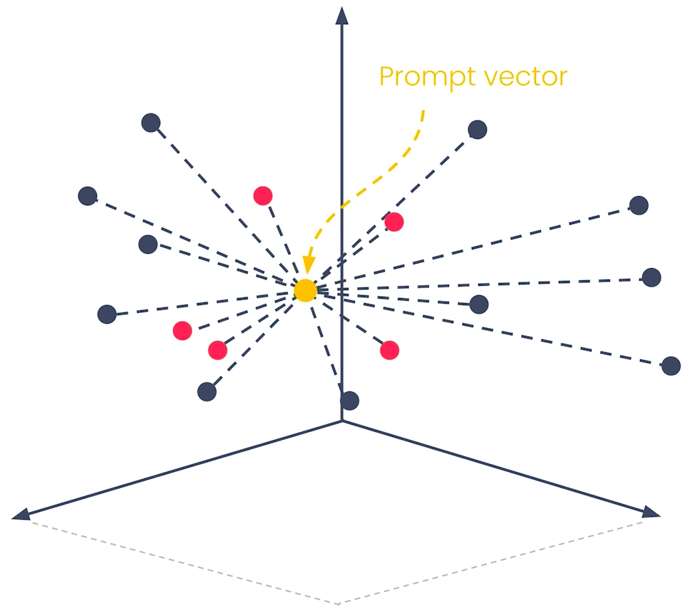
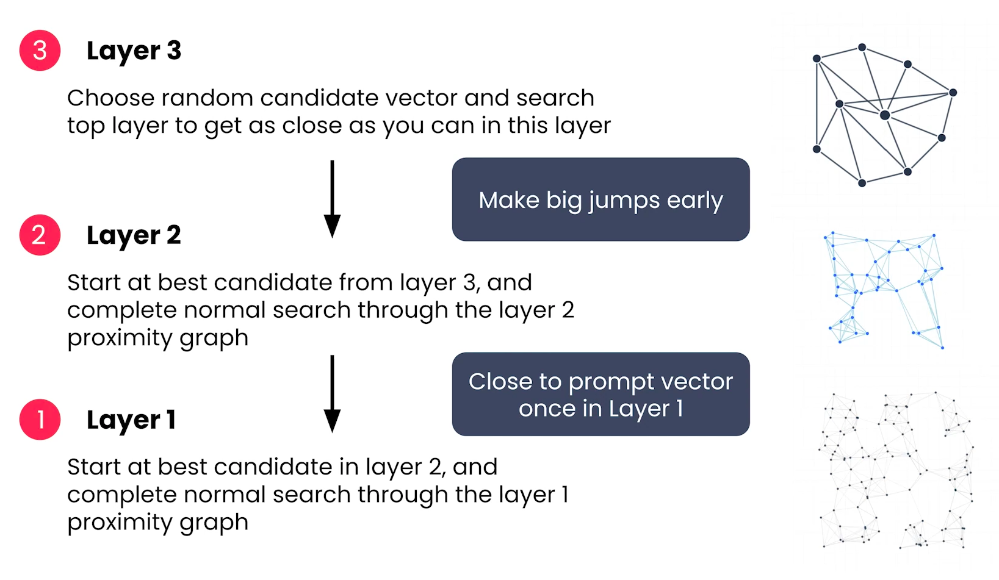

## 🎥 Video: Module 3 — Approximate Nearest Neighbors Algorithms (ANN)

**Instructor:** Zain Hassan  
**Module:** 3 — Information Retrieval with Vector Databases
**Video Duration:** ~8 minutes  
**Source:** [Coursera Lecture](https://www.coursera.org/learn/retrieval-augmented-generation-rag/lecture/AN4DT/approximate-nearest-neighbors-algorithms-ann)

---

## 🧭 1. Why ANN Matters

- Keyword and semantic search are foundational, but **scaling them introduces performance issues**.
- **Vector search**, if implemented naively, **scales poorly**:
  - High computational cost
  - Increased latency

---

## 🔍 2. The Problem with k-Nearest Neighbors (KNN)

- **KNN is the simplest form of vector retrieval**:
  1. Create embedding vectors for all documents and the prompt.
  2. Compute distances between prompt vector and each document vector.
  3. Sort documents by proximity.
  4. Return top-k closest documents.

  

- **Scalability issue**:
  - With 1,000 documents → 1,000 distance calculations.
  - With 1 billion documents → 1 billion calculations.
  - Result: **linear growth in compute cost**, making KNN impractical at scale.

  

---

## ⚡ 3. Enter ANN: Approximate Nearest Neighbors

- ANN algorithms **speed up search** by using **clever data structures**.
- Trade-off: **slightly less accurate**, but **much faster**.
- They find **very close** matches, not necessarily the absolute closest.

---

## 🕸️ 4. Navigable Small World (NSW) Algorithm

### a) Building the Proximity Graph

- Calculate distances between all document vectors.
- Create a **graph**:
  - Each document becomes a **node**.
  - Connect each node to a few of its **closest neighbors** via edges.

  

### b) Searching the Graph (Query Entry Point)

1. **Vectorize the prompt** to get a query vector.
2. **Randomly select a starting node** (candidate vector).
3. Traverse the graph:
   - Check neighbors of the current candidate.
   - Move to the neighbor closest to the query vector.
   - Repeat until no neighbor is closer than the current candidate.
4. Return the final candidate as the result.

> This process is fast because it only compares a few neighbors at each step.

---

## 🏗️ 5. Hierarchical Navigable Small World (HNSW)

### a) Multi-layer Graph Structure

- Layer 1: All document vectors (e.g., 1,000)
- Layer 2: Random subset (e.g., 100 vectors)
- Layer 3: Smaller subset (e.g., 10 vectors)

### b) Search Process

1. Start at **top layer (Layer 3)** with a random entry point.
2. Traverse to find best candidate in Layer 3.
3. Drop to **Layer 2**, starting from Layer 3’s best candidate.
4. Traverse Layer 2 to find best candidate.
5. Drop to **Layer 1**, the full graph.
6. Traverse Layer 1 to find final result.

> This hierarchical approach allows **big jumps early**, narrowing down quickly.

---

## 📈 6. Performance Comparison

- **KNN**: Linear time complexity → slow at scale.
- **HNSW**: Logarithmic time complexity → fast even with billions of vectors.
- Result: **Only a few hundred milliseconds of latency** for massive datasets.

---

## 🧠 7. Key Takeaways

- ANN algorithms:
  - Are **much faster** than KNN.
  - Return **close matches**, not guaranteed best.
  - Depend on a **precomputed proximity graph**, which is computationally expensive but done offline.

> “That’s a good summary of how ANN algorithms make vector search possible at scale.”

---

## 🛠️ 8. What’s Next

- You’ll now explore **tools** to implement these algorithms.
- Upcoming videos will cover **vector databases**, **Weaviate API**, and **chunking techniques**.
