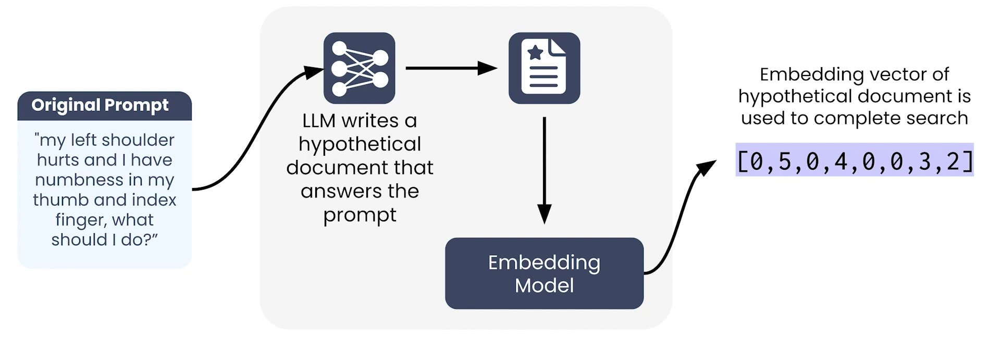

## 🎥 Video: Module 3 — Query Parsing  
**Instructor:** Zain Hassan  
**Video Duration:** ~6 minutes  
**Source:** [Coursera Query Parsing Lecture](https://www.coursera.org/learn/retrieval-augmented-generation-rag/lecture/JsPOs/query-parsing)

---

## 🧠 1. Why Query Parsing Is Essential

- In production RAG systems, users submit **natural, conversational prompts**.
- These prompts are often **poorly suited for retrieval**.
- Feeding raw prompts directly into a vector database leads to **low-quality results**.

> “Human-written LLM prompts make for bad search queries.”

---

## 🔧 2. What Query Parsing Does

- **Identifies intent** and **rewrites** the prompt to optimize it for retrieval.
- Can:
  - Clarify ambiguous phrases
  - Add synonyms
  - Remove irrelevant details
  - Use domain-specific terminology

---

## ✍️ 3. Basic Query Rewriting with LLMs

### 🧪 Example Setup:
- A RAG system built around **medical documents**.
- Use an LLM with a prompt like:

```text
The following prompt was submitted by a user in order to query a database of medical documents linking symptoms to diagnoses. Rewrite the prompt to optimize it for searching the database by doing the following:
- Clarify ambiguous phrases
- Use medical terminology where applicable
- Add synonyms
- Remove unnecessary or distracting information

{user prompt}
```

### 🧍 Original User Prompt:
> “I was out walking my dog, a beautiful black lab named Poppy, when she raced away from me and yanked on her leash hard while I was holding it. Three days later, my shoulder is still numb and my fingers are all pins and needles. What’s going on?”

### ✅ Rewritten Prompt:
> “Experienced a sudden forceful pull on the shoulder resulting in persistent shoulder numbness and finger numbness for three days. What are the potential causes or diagnoses such as neuropathy or nerve impingement?”

### 🎯 Benefits:
- Removes irrelevant context
- Adds medical terminology
- Improves retrieval precision

> “The benefits you gain from it are substantial and easily justify the additional costs of the LLM call.”


---

## 🧠 4. Advanced Query Parsing Techniques

### 🔍 a) Named Entity Recognition (NER)

- Identifies entities like:
  - People
  - Places
  - Dates
  - Characters
- Can be used to:
  - Inform vector search
  - Apply metadata filters

#### 🧪 Example Tool: Gliner
- Input: Text + list of entity types (e.g., person, book, location)
- Output: Labeled query with identified entities

> “This is a very efficient model, and we can run this every time a query comes in.”

---

### 📄 b) Hypothetical Document Embeddings (HyDE)

- Generate a **hypothetical document** that represents the ideal search result.
- Embed that document and use its vector for retrieval.

#### 🧪 Example:
- Original prompt: Shoulder and hand numbness after leash pull
- HyDE document: A clinical summary of nerve impingement symptoms
- Result: Retriever compares **similar types of text**, improving match quality

> “You’re helping the retriever understand not just the intent of the prompt, but what a high-quality result would look like.”


---

## ⚖️ 5. Tradeoffs and Recommendations

| Technique                  | Pros                                      | Cons                                |
|---------------------------|-------------------------------------------|-------------------------------------|
| Basic LLM Rewriting       | Easy to implement, high impact            | Requires LLM call per query         |
| Named Entity Recognition  | Adds structure, enables filtering         | Slight latency increase             |
| HyDE                      | Improves semantic match quality           | Computationally expensive           |

> “In almost every case, basic query rewriting is the right approach.”

---

## 🎯 Final Takeaway

- Start with **basic LLM rewriting**.
- Experiment with advanced techniques like **NER** and **HyDE** if needed.
- Let **retrieval performance** guide your decisions.

> “Experiment with these advanced techniques and let the results decide how your project needs to evolve.” — Zain Hassan
