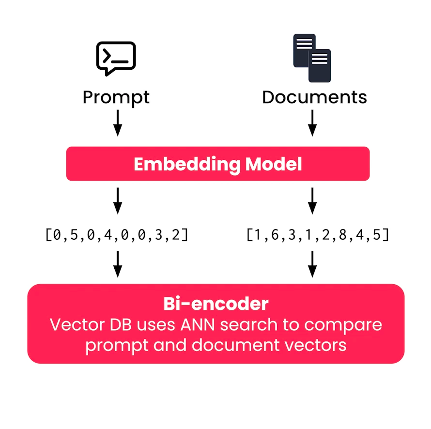

## 🎥 Video: Module 3 — Cross-encoders and ColBERT  
**Instructor:** Zain Hassan  
**Video Duration:** ~8 minutes  
**Source:** [Coursera Video](https://www.coursera.org/learn/retrieval-augmented-generation-rag/lecture/8BPMB/cross-encoders-and-colbert)

---

## 🧠 Semantic Search Recap

- Most semantic search systems use a **bi-encoder architecture**:
  - Each document is embedded into a **single vector**.
  - The prompt is also embedded into a **single vector**.
  - Retrieval is done by comparing vector similarity using **ANN algorithms**.

> “The term bi-encoder refers to the fact that the documents and prompt are embedded separately.”

- Advantage: Documents can be embedded **ahead of time**, speeding up search.

---

## 🎯 1.  Bi-Encoder Architecture

### 🔹 Separate Semantic Vectors
- Documents and prompts are embedded **separately** using the same embedding model.
- Each document becomes a **single vector**.
- Each prompt becomes a **single vector**.
- These vectors are compared using **vector similarity**.

> “The term bi-encoder refers to the fact that the documents and prompt are embedded separately.”

### 🔹 ANN Search
- A **vector database** uses **Approximate Nearest Neighbor (ANN)** search.
- It rapidly identifies documents whose vectors are **close to the prompt vector**.
- This enables **fast semantic retrieval**.

### 🔹 Document Vectors Are Pre-Computed
- Document embeddings are created **ahead of time**.
- At query time, only the **prompt** needs to be embedded.
- This makes bi-encoders **highly efficient and scalable**.

---

### 📊 Visual Diagram Breakdown

#### 🔧 Embedding Model Input
- **Prompt** → embedded into: `[0.5, 0.4, 0.8, 0.3, 2]`
- **Documents** → embedded into:
  - Doc 1: `[1, 0.5, 0.4, 0.3, 2]`
  - Doc 2: `[0.8, 0.4, 0.3, 2, 1]`
  - Doc 3: `[0.5, 0.4, 0.3, 2, 1]`

---

### 🔍 Retrieval Process
- These vectors are stored in a **vector database**.
- When a prompt is received:
  - Its vector is compared to all document vectors.
  - ANN search returns the **most similar documents**.

---

## ✅ Advantages

| Feature              | Benefit                                |
|----------------------|----------------------------------------|
| Preprocessing        | ✅ Documents embedded ahead of time     |
| Speed                | ✅ Only prompt embedded at query time   |
| Storage              | ✅ One vector per document              |
| Scalability          | ✅ Excellent for large corpora          |
| Simplicity           | ✅ Easy to implement and deploy         |

---

## 🎯 2. Cross-Encoder Architecture

### 🔧 How It Works:
- Concatenates the **prompt + document text**.
- Passes the combined text into a **specialized model**.
- Outputs a **relevance score** (typically between 0 and 1).

### 🧪 Example:
- Prompt: “Great places to eat in New York”
- Document: Restaurant review
- Cross-encoder input: `"Prompt + Document"`
- Output: Relevance score (e.g., 0.7)

> “This allows the model to understand deep contextual interactions between the prompt and document.”

### ✅ Benefits:
- **Highest quality** retrieval results.
- Captures **rich semantic relationships**.

### ⚠️ Drawbacks:
- **No pre-processing** possible as this technique needs to run on prompt-document pairs (prompt needed first).
- **Terrible scalability**:
  - Must run **billions of prompt-document pairs** at query time.
  - Not feasible for large corpora.

---

## ⚖️ 3. Summary of Tradeoffs

| Architecture   | Speed       | Quality     | Storage     | Scalability |
|----------------|-------------|-------------|-------------|-------------|
| Bi-encoder     | ✅ Fast      | ⚠️ Moderate | ✅ Minimal   | ✅ Excellent |
| Cross-encoder  | ❌ Slow      | ✅ Best     | ❌ None      | ❌ Poor      |

> “Cross-encoders are too inefficient to use as a default search technique.”

---

## 🧠 4. ColBERT Architecture (Contextualized Late Interaction over BERT)

### 🔧 How It Works:
- Documents are embedded **ahead of time**, like bi-encoders.
- But instead of one vector per document, ColBERT generates:
  - **One vector per token** in the document.
  - Same for the prompt.

### 🧪 Example:
- Document: 1,000 tokens → 1,000 vectors
- Prompt: 10 tokens → 10 vectors
- Result: A **10 × 1,000 grid** of similarity scores.

### 📊 Scoring:
- For each **prompt token**, find the **most similar document token**.
- Take the **maximum similarity score** per prompt token.
- Sum these scores → final document relevance score.

> “This is known as the max sim score.”

---

## ✅ Benefits of ColBERT

- Captures **deep token-level interactions**.
- **Much faster** than cross-encoders.
- **More accurate** than bi-encoders.

### ⚠️ Drawbacks:
- **High storage cost**:
  - Must store **one vector per token**.
  - A 2,000-token document → 2,000 vectors.
- **More compute** than bi-encoders, but still usable in real-time.

---

## 🧪 Use Cases

- ColBERT is ideal for domains needing **precision**:
  - Legal
  - Medical
  - Scientific research

> “The trade-off of increased vector storage may be worth it.”

---

## 🎯 Final Takeaway

- **Bi-encoders**: Default for speed and scale.
- **Cross-encoders**: Gold standard for quality, but too slow.
- **ColBERT**: Middle ground — near cross-encoder quality with bi-encoder speed.

> “Join me in the next video and let’s see how cross-encoders are integrated into production retrieval systems despite their significant inefficiencies.” — Zain Hassan