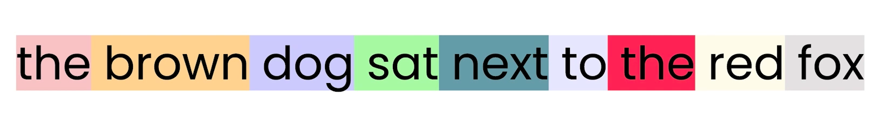

## 📘 Notes: Module 4 — Transformer Architecture  
**Instructor:** Zain Hassan  
**Video Duration:** ~9 minutes  
**Source:** [Coursera Video](https://www.coursera.org/learn/retrieval-augmented-generation-rag/lecture/iY10m/transformer-architecture)

---

### 🧠 1. Why Transformers Matter in RAG

- In RAG, you send a prompt to an LLM and get a response grounded in retrieved info.
- But **why does this work**? How does the LLM understand the retrieved text?
- To answer that, we need to understand the **transformer architecture** that powers LLMs.

---

### 📜 2. Origin of Transformers

- Introduced in the **2017 paper**: *Attention Is All You Need*.
- Originally designed for **machine translation**.
- Architecture includes:
  - **Encoder**: Understands source text (e.g., German).
  - **Decoder**: Generates target text (e.g., English).

> “Most LLMs only include the decoder component, since they focus on text generation.”

---

### 🧠 3. Transformers in Embedding Models vs LLMs

- **Embedding models** use the encoder to create rich semantic representations.
- **LLMs** use the decoder to generate text based on input prompts.

---

### 🧩 4. Prompt Journey Through a Transformer

#### 🔹 Tokenization
- Prompt is split into **tokens** (sub-word units).
- Each token gets:
  - A **dense vector** (first guess of meaning)
  - A **positional vector** (location in prompt)

> “These guesses are static — the same token always gets the same initial vector.”

---

#### 🔹 Attention Mechanism

- Each token looks at **every other token** in the prompt.
- It decides **which tokens to pay attention to**.
- Attention = which tokens most influence its meaning.

#### 🧪 Example:
- Sentence: *“The brown dog sat next to the red fox.”*
- Token “dog” might attend to:
  - “brown” (70%)
  - “sat” (20%)
  - Others (10%)

> “Attention is a fancy way of saying which other tokens should have the biggest impact on my meaning.”

---

#### 🔹 Attention Heads

- Each attention head specializes in a different type of relationship:
  - Descriptions (e.g., “fox” → “brown”)
  - Spatial relationships (e.g., “fox” → “sat”, “next”)

> “Smaller models use 8–16 heads; larger ones use 100+.”

- Each token tracks relationships **multiple times**, each with a different focus.

---

#### 🔹 Feedforward Phase

  - Input Embeddings → Initial token vectors
  - Attention → Each token looks at others to decide relevance
  - Feed Forward → Combines attention with original vector

- After attention, tokens enter a **feedforward network**.
- This updates each token’s vector based on:
  - Original embedding
  - Position
  - Attention scores

> “These are second guesses of each token’s meaning — now informed by context.”

##### Is Iterative Refinement:
In a transformer model, each token (like “dog” or “sat”) starts with a first guess of its meaning—based on its embedding and position. But that guess is not final. The model refines it through a series of layers, each consisting of:

- Attention: Determines which other tokens influence the current token.
- Feedforward network: Updates the token’s vector based on attention scores and context.
- This process is repeated across 8 to 64 layers, depending on model size.

---

### 🧠 5. Text Generation

- Once embeddings are refined:
  - Model predicts **next token** using a **probability distribution**.
  - Chooses one token based on probabilities.
  - Appends it to the prompt.
  - Repeats the entire process for each new token.

> “Generating a single token takes a lot of processing.”

---

### ⚠️ 6. Implications for RAG

#### ✅ Why RAG Works
- LLMs deeply understand the **meaning and relevance** of retrieved info.
- Thanks to:
  - Attention mechanism
  - World knowledge in feedforward layers

#### ⚠️ Randomness
- LLMs are **inherently random**.
- Even with good context, they may **ignore it** or generate unrelated text.

> “Controlling this randomness is still necessary.”

#### 💰 Cost
- Transformers are **computationally expensive**.
- Cost grows with:
  - Prompt length
  - Completion length

> “Most costs in RAG come from running these powerful transformer models.”

---

### 🎯 Final Takeaway

- Transformers enable LLMs to:
  - Understand context
  - Track relationships
  - Generate coherent, grounded text
- This architecture is the **foundation** of why RAG systems work.

> “Now let’s turn our attention — no pun intended — to how you can refine their behavior inside your RAG system.”
