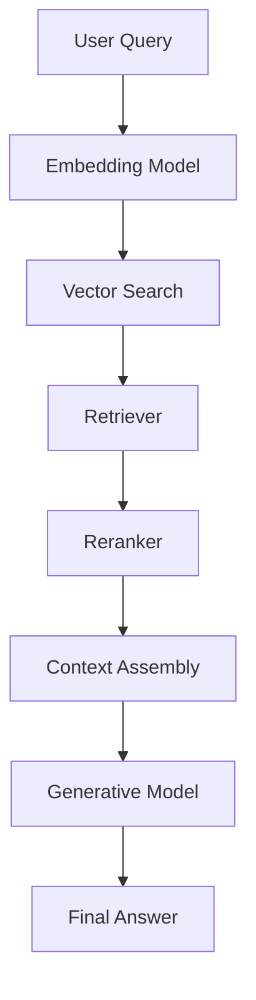

### 🌐 Connect with Me

[](https://github.com/mohammedkh97) [](https://linkedin.com/in/mohammed-khalaf97) [](mailto:Mohamedkhalaf20172020@gmail.com) [](https://wa.me/+201022508443)

# 🔍 Retrieval-Augmented Generation (RAG) Architecture

**Author**: Mohamed Khalaf  
**Inspired by**: Manish Mazumder’s ML System Design Series

## 📘 Overview

Retrieval-Augmented Generation (RAG) enhances LLMs by integrating external knowledge sources during inference. This hybrid architecture reduces hallucinations, improves factual accuracy, and enables scalable, domain-specific applications.

---

## 🧠 Why RAG?

Traditional LLMs:

- Rely solely on training data
- Hallucinate under knowledge gaps
- Require costly retraining for updates

RAG solves this by:

- Dynamically retrieving relevant documents
- Generating answers grounded in external context
- Supporting niche, evolving domains (e.g., legal, medical, research)

---

## 🏗️ RAG Architecture Components

| Component           | Role                                                                |
| ------------------- | ------------------------------------------------------------------- |
| **Vector DB**       | Stores embeddings for semantic search (e.g., FAISS, Pinecone)       |
| **Embedding Model** | Converts text into dense vectors (e.g., MiniLM, BERT)               |
| **Retriever**       | Finds top-k relevant documents (dense/sparse)                       |
| **Reranker**        | Refines retrieved results for precision (e.g., Cohere, BERT)        |
| **Generator**       | Produces final answer using query + retrieved context (e.g., GPT-4) |

---

## 🔄 End-to-End Pipeline



---

## 🧪 Code Snippet: Toy RAG Pipeline

```python
from sentence_transformers import SentenceTransformer
import faiss, numpy as np

# Step 1: Embedding
model = SentenceTransformer("all-MiniLM-L6-v2")
documents = ["RAG stands for Retrieval-Augmented Generation.", ...]
doc_embeddings = model.encode(documents)

# Step 2: Indexing
index = faiss.IndexFlatL2(doc_embeddings.shape[1])
index.add(doc_embeddings)

# Step 3: Retrieval
query = "What does RAG mean?"
query_embedding = model.encode([query])
_, indices = index.search(query_embedding, k=2)
retrieved = [documents[i] for i in indices[0]]
```

---

## 🧠 RAG Variants

- **RAG-Sequence**: Same docs for entire answer
- **RAG-Token**: Different docs per token
- **Fusion-in-Decoder**: All docs concatenated before generation
- **Multi-hop RAG**: Iterative retrieval across reasoning steps

---

## ✅ Pros & ❌ Cons

| ✅ Strengths                      | ❌ Challenges                   |
| --------------------------------- | ------------------------------- |
| Reduces hallucinations            | Adds latency (~100–500ms)       |
| Easily updated knowledge base     | Requires storage & maintenance  |
| Handles niche domains effectively | Embedding adaptation for jargon |

---

## 🚀 When to Use RAG

**Use RAG if:**

- You need factual accuracy
- Your domain is dynamic or specialized
- You're building enterprise-grade Q&A

**Avoid RAG if:**

- Data is static or small
- Latency must be ultra-low
- Full interpretability is required

---

## 🔮 Future Directions

- **Hybrid Search**: Combine keyword + semantic retrieval
- **Memory-Augmented RAG**: Maintain long-term context
- **Multi-Modal RAG**: Retrieve across text, images, audio, video

---

## 📚 References

- [RAG Architecture Explained – Manish Mazumder](https://manishmazumder5.substack.com/p/rag-architecture-explained-ml-system)
- Hugging Face Transformers
- FAISS by Facebook AI
- SentenceTransformers
