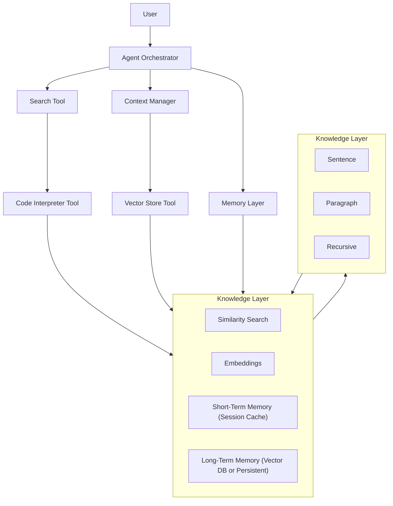

```mermaid
flowchart TD

    %% User
    U[User] --> AO[Agent Orchestrator]

    %% Agent Orchestrator connections
    AO --> ST[Search Tool]
    AO --> CM[Context Manager]
    AO --> ML[Memory Layer]

    %% Search tool chain
    ST --> CIT[Code Interpreter Tool]
    CIT --> KL1[Knowledge Layer]

    %% Context Manager chain
    CM --> VST[Vector Store Tool]
    VST --> KL1

    %% Memory Layer connections
    ML --> KL1

    %% Knowledge Layer components
    subgraph KL1[Knowledge Layer]
        SS["Similarity Search"]
        E["Embeddings"]
        STM["Short-Term Memory (Session Cache)"]
        LTM["Long-Term Memory (Vector DB or Persistent)"]
    end

    %% Second Knowledge Layer (bottom)
    KL1 --> KL2[Knowledge Layer]
    subgraph KL2[Knowledge Layer]
        S["Sentence"]
        P["Paragraph"]
        R["Recursive"]
    end

    %% Connections between layers
    KL2 --> KL1

```